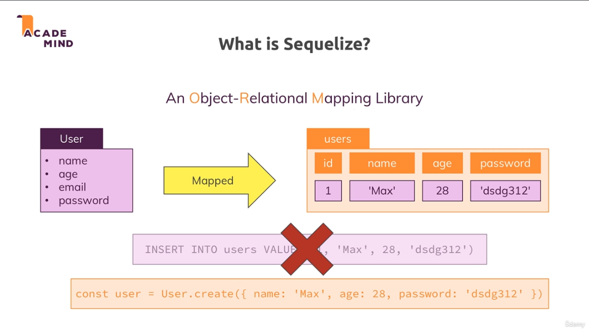
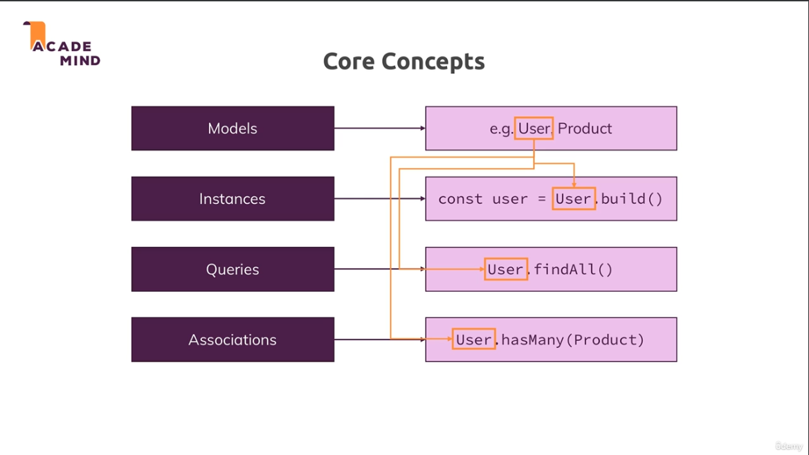
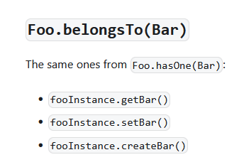
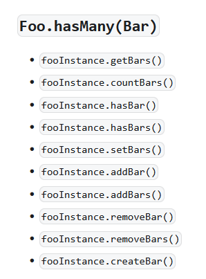
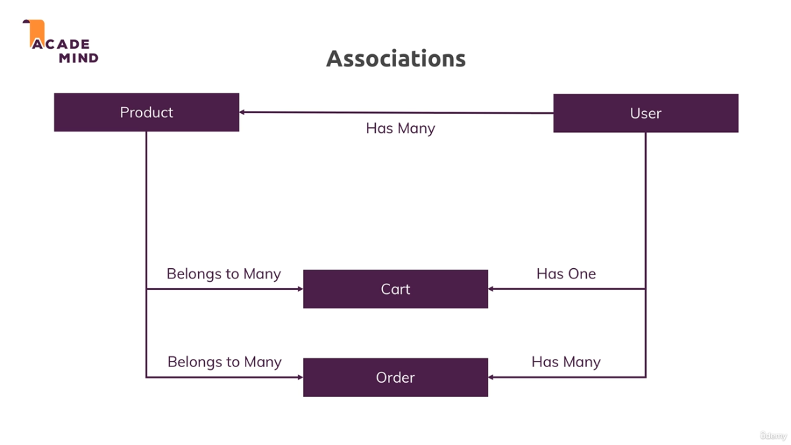
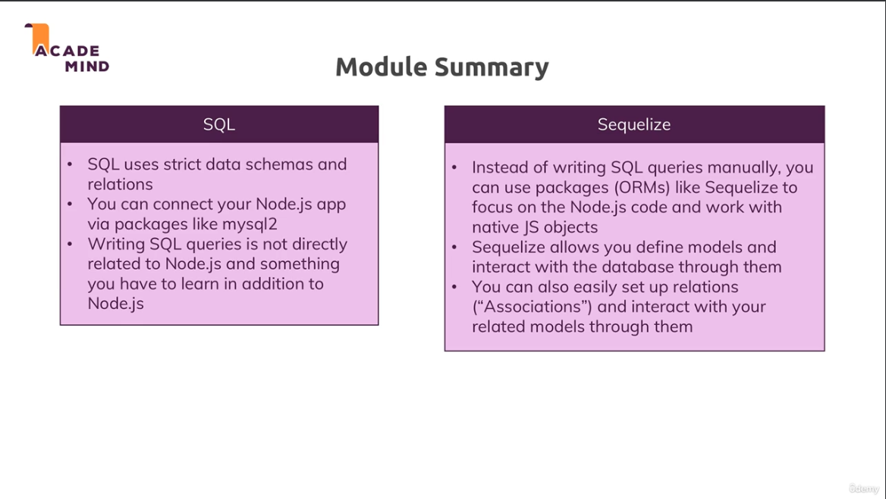

[<<-- back to main](../../README.md) - [<-- previous section](../section%2010%20SQL%20introduction/section10-notes.md) - [next section -->](../section%2012%20working%20with%20nosql%20and%20using%20mongodb/section12-notes.md)

# sample: image urls
- https://cdn.pixabay.com/photo/2016/03/31/20/51/book-1296045_960_720.png

# What is sequelize

# ORM- Object Relational Mapping core concepts

- DAO= Data Access Object
- ORM= Object Relational Mapping 

# Special methods/mixins

# Product,User,Cart,Order Association

# module summary

# Useful resource:
- Sequelize Official Docs: http://docs.sequelizejs.com/

[<<-- back to main](../../README.md) - [<-- previous section](../section%2010%20SQL%20introduction/section10-notes.md) - [next section -->](../section%2012%20working%20with%20nosql%20and%20using%20mongodb/section12-notes.md)