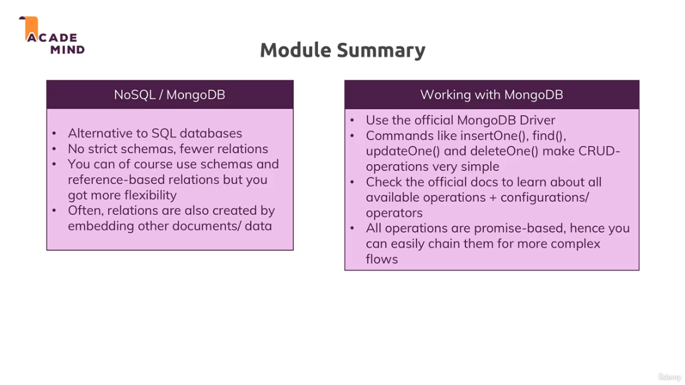

[<<-- back to main](../../README.md) - [<-- previous section](../section%2011%20understanding%20sequelize/section11-notes.md) - [next section -->](../../README.md)

# sample: image urls
- https://cdn.pixabay.com/photo/2016/03/31/20/51/book-1296045_960_720.png

# Note:
- mongodb stores documents in form of BSON (Binary JSON)
- so _id value will be of example -> ObjectId('651977a320846e40db61d7c5')
- on binding the _id to UI html
- we dont need to do <%= product._id.toString() %> 
- instead the template on rendering will convert it to toString

# module summary

# Useful resource:
- MongoDB Official Docs: https://docs.mongodb.com/manual/
- SQL vs NoSQL: https://academind.com/learn/web-dev/sql-vs-nosql/
- Learn more about MongoDB: https://academind.com/learn/mongodb

[<<-- back to main](../../README.md) - [<-- previous section](../section%2011%20understanding%20sequelize/section11-notes.md) - [next section -->](../../README.md)
