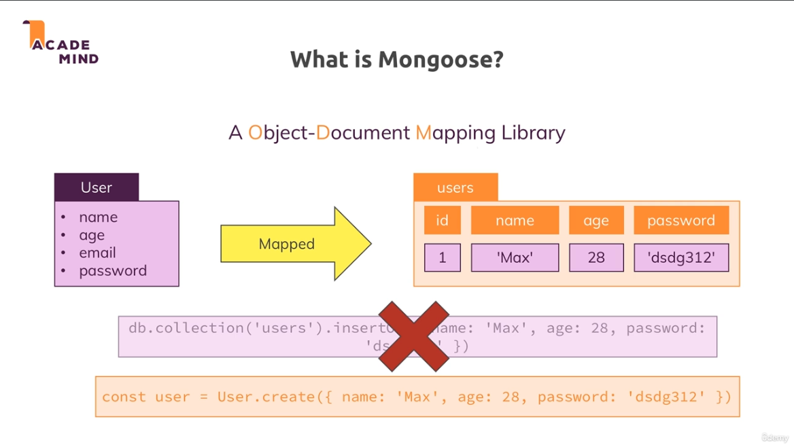
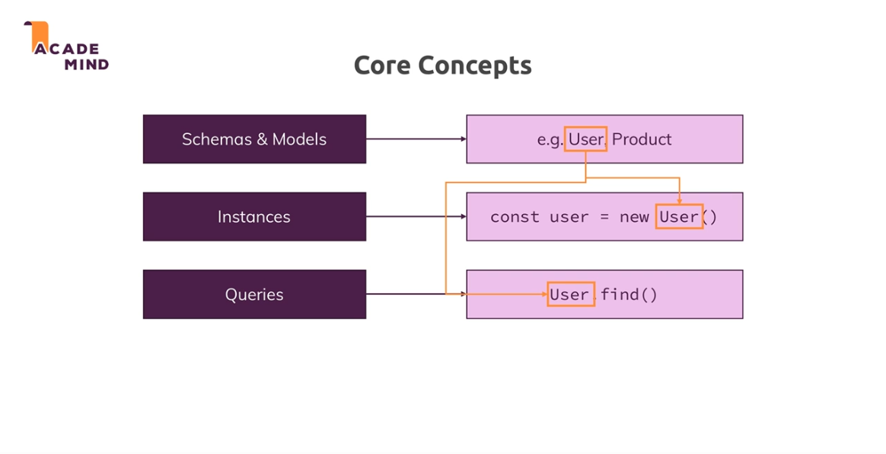

[<<-- back to main](../../README.md) - [<-- previous section](../section%2012%20working%20with%20nosql%20and%20using%20mongodb/section12-notes.md) - [next section -->](../../README.md)

# sample: image urls
- https://cdn.pixabay.com/photo/2016/03/31/20/51/book-1296045_960_720.png

# what is a mongoose?
- Mongoose is an ODM (Object Document Mapping) library for Mongodb
- Mongoosejs - https://mongoosejs.com/docs/


# core concepts


```
MONGODB WITH MONGOOSE KEY POINTS:
Notes:
1.  while creating the collection(table) in our db,
    mongoose will autopick the mongoose.model('Product', productSchema); model name 'Product' and lowercase it and create
2.  when using mongoose, we use any method like .findById(someId) -> someId can be passed as string,
    mongoose will auto convert internally to ObjectId type
3.  for referencing other collection-document we use property ref -> which takes modelschema name we defined
      userId: {
        type: Schema.Types.ObjectId,
        ref: 'User', // refering to modelschema name
        required: true
      }
4. .select() feature, provides provision to pick only needed field which we describe
    like   Product.find().select('title price -_id') => here title and price is included
    _id is always included but we can explicitly exclude by specifying -(minus)
5.  .populate() feature allows us to populate the doc property that has other collection-doc reference
    like Product.find().populate('userId')
6. .populate() with control over fields that we require,
    like Product.find().populate('userId', 'name')
    here we not just fetch another collection-doc, but only get that doc with the name property
7.  if we have scenario where, we assign an modelschema to a property but we only need properties of that document
    we can use => product: {...item.productId._doc} => here item.productId is a modelschema,
    we extract only doc properties only by using _doc
```

# Useful resource:
- Mongoose Official Docs: https://mongoosejs.com/docs/

[<<-- back to main](../../README.md) - [<-- previous section](../section%2012%20working%20with%20nosql%20and%20using%20mongodb/section12-notes.md) - [next section -->](../../README.md)