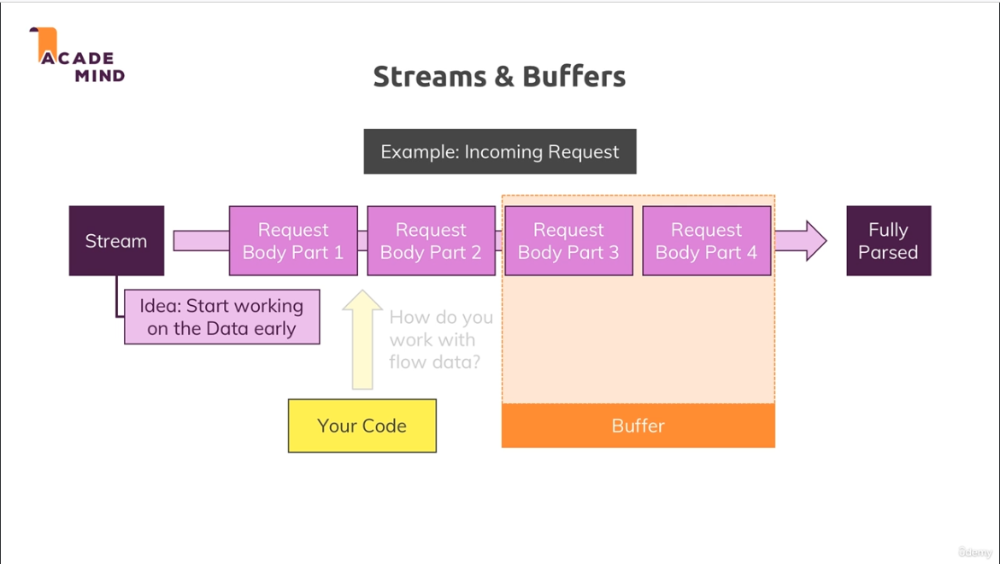
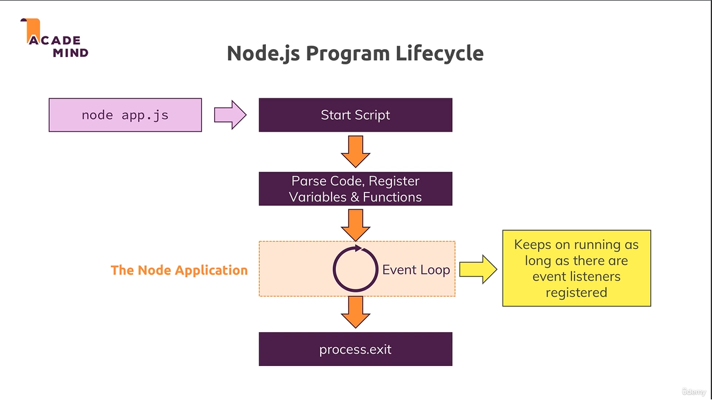
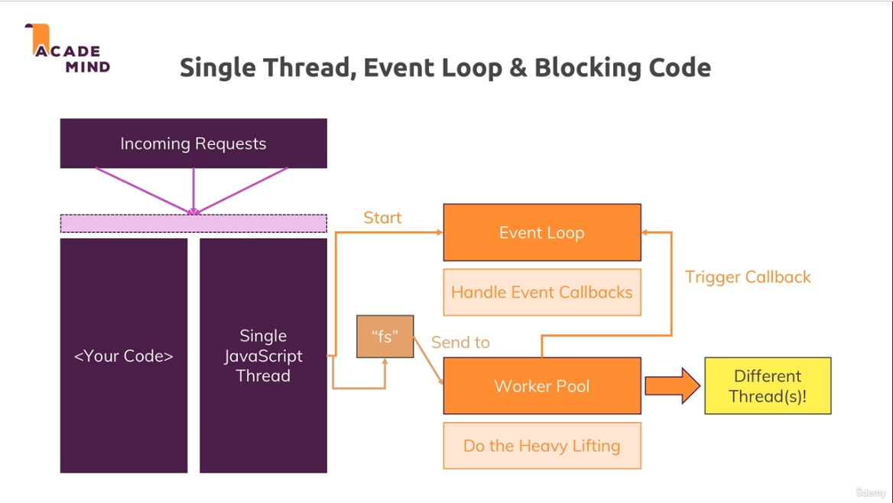
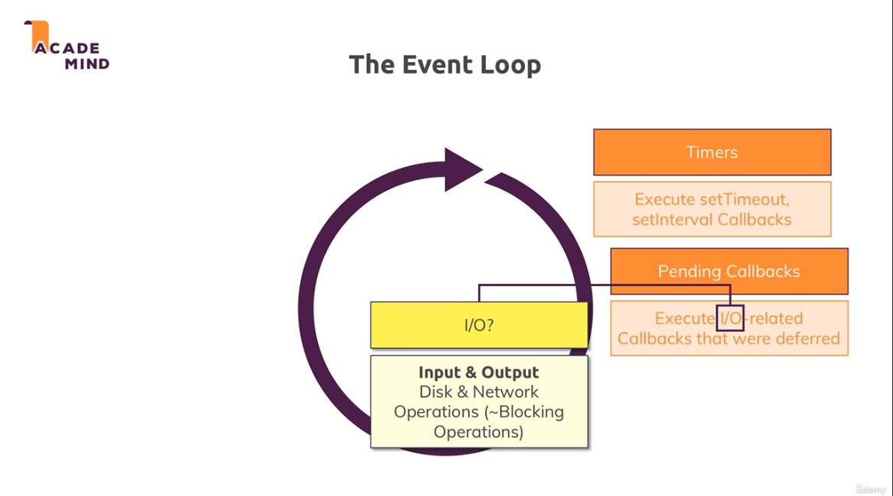
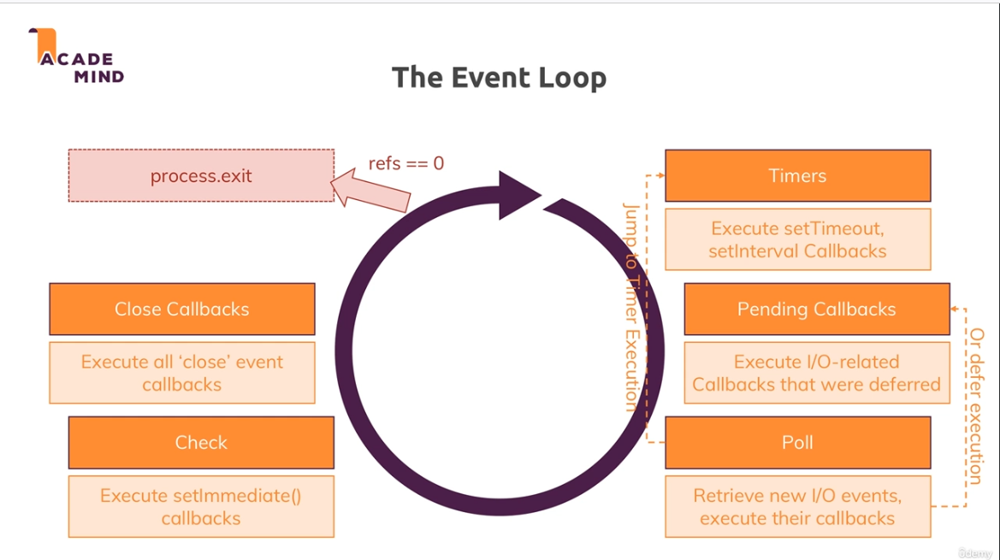
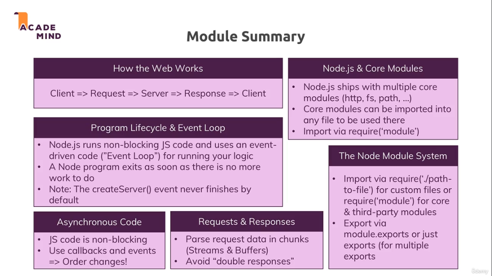

[<<-- back to main](../../README.md) - [next section -->](../section%204%20development%20workflow%20and%20debugging/section4-notes.md)

# Section 3 - understanding the basics

1. some core modules available in node.js are http,https,fs,path,os
- http - working with REST api
- https - working with REST api with SSL cert (data encryption with transmission)
- path - used to construct paths for files, file system
- os - working with os related infos
- fs - working with file system
2. these modules are not globally available, hence we need to import with require()
3. if we write res.write() after res.end() it will result in error
4. fs.writeFileSync() is blocking sync code and fs.writeFile() is non-blocking async code
5. about require
- require() in nodejs is equivalent to import
- require('http') - will look for http node_modules package in root directory
- require('./xyz') - will look for xyz as relative path
- require('/xyz') - will look for xyz as absolute path
6. server listen and exit
- server.listen(port, hostname) = used to run server
- process.exit() = used to stop/exit the server
7. lifecycle
nodejs lifecycle => run script -> event loop -> execute listeners on req -> process exit(hard exit the event loop)
8. sending response in nodejs
- res.setHeaders() -> to set setHeaders
- res.write() -> we can use to write multiple lines of chunk codes
- res.end() -> after this we should not write res.write(), this ends the construction of response and send the response
9. important - response for redirection is like
- res.statusCode = 302; -> set status code 302 for redirect
- res.setHeader('Location', '/'); -> set header location and url
- res.end(); -> send response

# streams and buffers

# nodejs life cycle

# single thread, event loop and blocking code

# event loop

# module summary

# DIY router
1. https://hackernoon.com/understanding-express-js-creating-your-own-node-http-request-router-4190a9b6aad6

# Useful resources:
1. Official Node.js Docs: https://nodejs.org/en/docs/guides/
2. Full Node.js Reference (for all core modules): https://nodejs.org/dist/latest/docs/api/
3. More about the Node.js Event Loop: https://nodejs.org/en/docs/guides/event-loop-timers-and-nexttick/
4. Blocking and Non-Blocking Code: https://nodejs.org/en/docs/guides/dont-block-the-event-loop/

[<<-- back to main](../../README.md) - [next section -->](../section%204%20development%20workflow%20and%20debugging/section4-notes.md)
