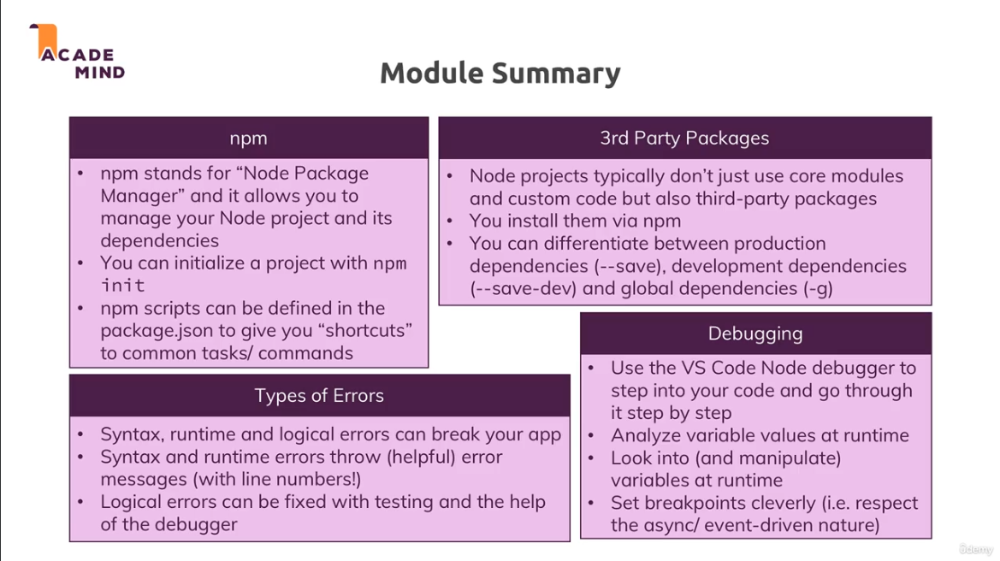

[<<-- back to main](../../README.md) - [<-- previous section](../section%203%20understanding%20the%20basics/section3-notes.md) - [next section -->](../../README.md)

# creating package.json
1. use "npm init" command to create package.json
2. add "start": "node app.js" in scripts
3. for execution use "npm start" command
4. since start is reserved command, we dont need to provide like "npm run start" or "npm run-script start" 

# installing 3rd party package as devDependency or as global package
1. when installing by command "npm i nodemon -g", will install package globally in your system
2. when installing by command "npm i nodemon --save-dev", will install package for development env only inside your project

# Global Features vs Core Modules vs Third-Party Modules
You can basically differentiate between:
1. Global features: Keywords like const or function but also some global objects like process
2. Core Node.js Modules: Examples would be the file-system module ("fs"), the path module ("path") or the Http module ("http")
3. Third-party Modules: Installed via npm install - you can add any kind of feature to your app via this way
4. we will be using nodemon package for autorestarts

# module summary

# Useful resources:
1. More on debugging Node.js: https://nodejs.org/en/docs/guides/debugging-getting-started/
2. Debugging Node in Visual Studio Code: https://code.visualstudio.com/docs/nodejs/nodejs-debugging

[<<-- back to main](../../README.md) - [<-- previous section](../section%203%20understanding%20the%20basics/section3-notes.md) - [next section -->](../../README.md)