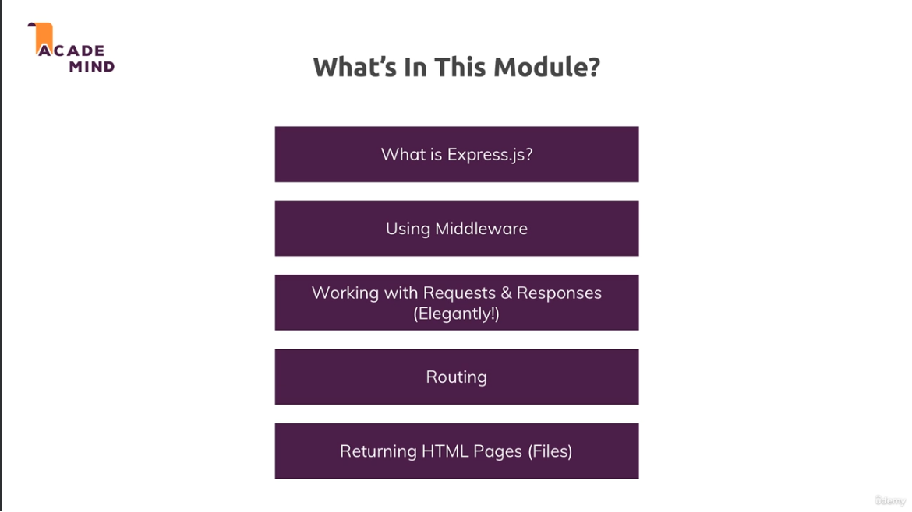
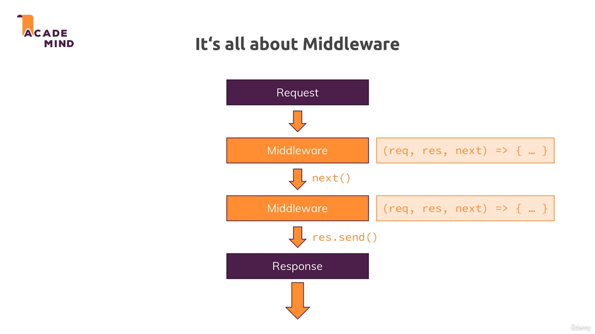
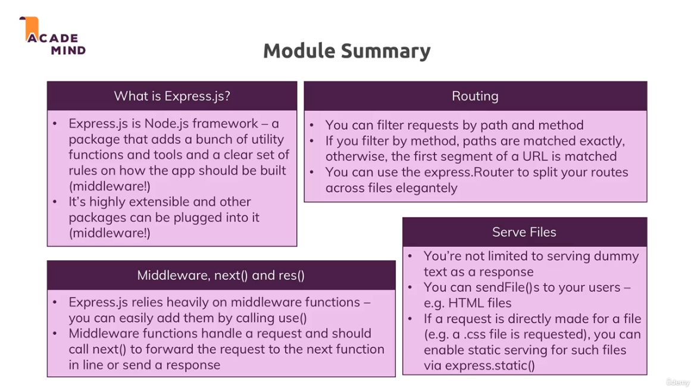

[<<-- back to main](../../README.md) - [<-- previous section](../section%204%20development%20workflow%20and%20debugging/section4-notes.md) - [next section -->](../../README.md)

# express.js

# middleware

- exact matching of route only happens with app.get()/app.post(), not for app.use()

# module summary

[<<-- back to main](../../README.md) - [<-- previous section](../section%204%20development%20workflow%20and%20debugging/section4-notes.md) - [next section -->](../../README.md)
