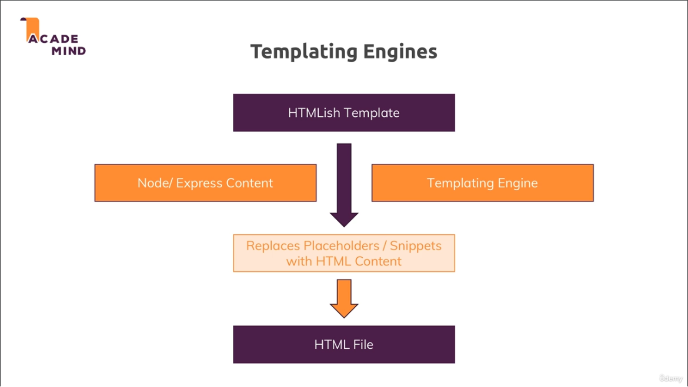
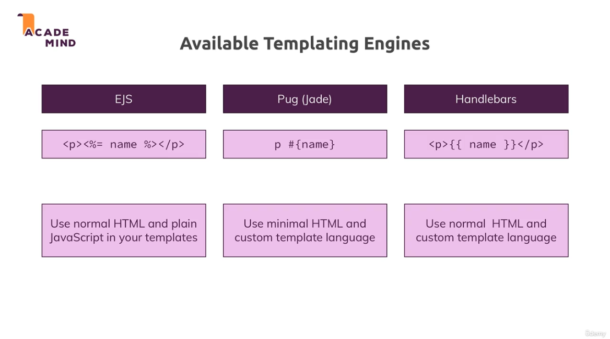
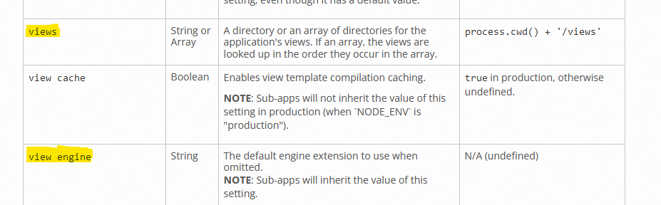

[<<-- back to main](../../README.md) - [<-- previous section](../section%205%20working%20with%20express.js/section5-notes.md) - [next section -->](../section%207%20model%20view%20controller/section7-notes.md)

# Section 6 working with dynamic contents and templating engines

# templating engines overview


# templaing engines used in course


# app.set() 'view engine' and 'views'


# official pug docs
- https://pugjs.org/api/getting-started.html

```
WORKING WITH DYNAMIC CONTENT & TEMPLATING ENGINES
- NPM Packages
    "ejs": "^3.1.9",
    "express-handlebars": "^7.x.x", -> but changing to "express-handlebars": "^3.0.2" to avoid error in the course
    "pug": "^3.0.2"

- HTMLish file -> (node/express content + templating engines) -> page presented to users
- LIST OF TEMPLATING ENGINES:
    -   EJS - use normal html and plain javascript in the templates
    -   Pug(Jade) - use minimal html and custom template language
    -   Handlebars - use normal html and custom template language
- templating engines short examples
    - EJS - <p><%= name %></p>
    - Pug(Jade) - p #{name}
    - Handlebars - <p>{{ name }}</p>
-------------------------------------------------------
WORKING WITH PUG
- To set the templating engine
app.set('view engine', 'pug'); -> "view engine" is reserved keyword, and setting 'pug'
app.set('views', 'views'); 
    -> "views" refers to path where the htmls are present, in our case it will reside inside 'views' dir inside rootdir

writing a pug html:
- file extensions should be .pug (not .html and regular html content wont work)
- use html:5 emmet abbrevation from VS Code to create boilerplate pug html content with html,head,body tags
- indentation matters in pug
- when lines of code are nested, means equivalent to child tag 
- when lines of code are in same indent, means equivalent to sibling tags

render pug file to UI:
  res.render() automatically uses the 'view engine' which we provided
  it also directly look in the 'views' dir which we provided
  so it is enough to mention the file name with out the .pug extension which is enough like -> res.render('shop');  

syntax to add dynamic content in pug file
- #{key-name} -> key-name from the obj we pass as 2nd arg in -> res.render('shop', some-obj);

pug key points:
1. related to div tags
    <div class="grid"></div> (in normal html)
    can be written as -> div.grid 
    this also further we can cut short to only -> .grid (because default pug will assume it as div)

handlebars key points:
1. setting view engine
    in order to set express-handlebars as view engine
    app.engine('hbs', expressHbs());
    app.set("view engine", "hbs"); // the name engine name that we set should be file extentions of our htmls like .hbs

DIFF PUG vs Handlebars
- in pug we can evaluate the conditional statements like >, < etc inside if block
- in handlebars we cant evaluate conditional statements like >, < etc inside if block,
- we have to pass boolean directly as content for handlebars like
{{#if prods.length > 0}} -> will not work, if statement needed direct boolean value
{{#if hasProducts}} -> will work as we are passing direct boolean value

```

# Useful resources:
- Pug Docs: https://pugjs.org/api/getting-started.html
- Handlebars Docs: https://handlebarsjs.com/
- EJS Docs: http://ejs.co/#docs

[<<-- back to main](../../README.md) - [<-- previous section](../section%205%20working%20with%20express.js/section5-notes.md) - [next section -->](../section%207%20model%20view%20controller/section7-notes.md)
