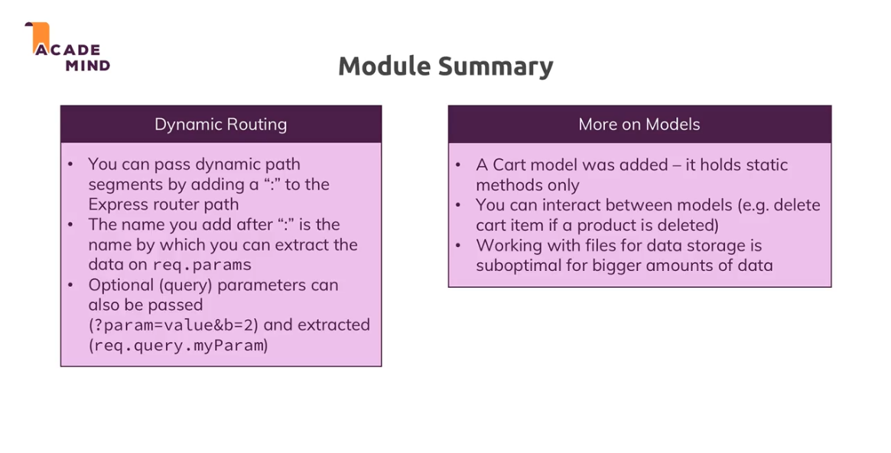

[<<-- back to main](../../README.md) - [<-- previous section](../section%208%20enhancing%20the%20app/section8-notes.md) - [next section -->](../section%2010%20SQL%20introduction/section10-notes.md)

# sample: image urls
- https://cdn.pixabay.com/photo/2016/03/31/20/51/book-1296045_960_720.png

```
Note: techinally a delete cannot be used via get call, henceforth we change like this, enclose in a form with action
<form action="/cart" method="POST">
    <button class="btn" type="submit">Add to Cart</button>
</form>

if we have clash between dynamic routes and more specific routes like
/products/delete vs /products/:productId
then the more specific route should be placed at the top and dynamic route at the bottom
as express routes execute in top to bottom approach
```

# module summary


# Useful resources:
- Official Routing Docs: https://expressjs.com/en/guide/routing.html

[<<-- back to main](../../README.md) - [<-- previous section](../section%208%20enhancing%20the%20app/section8-notes.md) - [next section -->](../section%2010%20SQL%20introduction/section10-notes.md)
